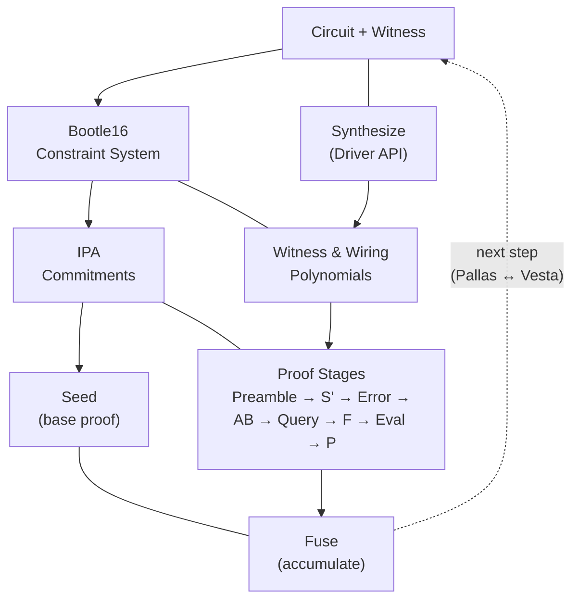
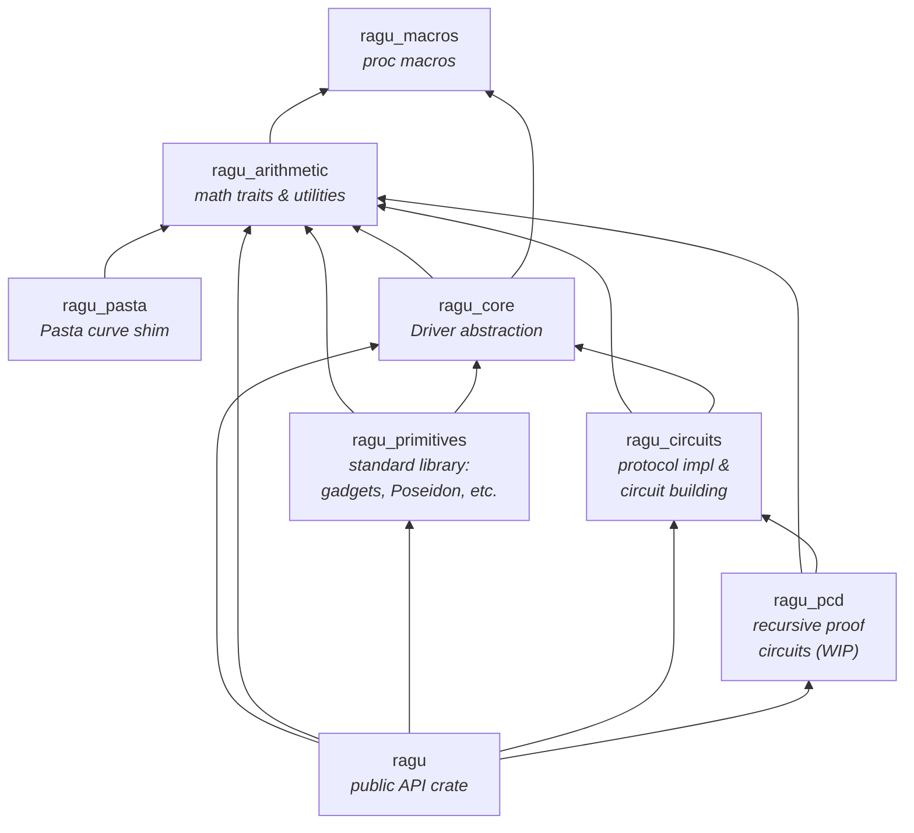

# Architecture Overview

## Overall Flow

The diagram below shows the lifecycle of a Ragu proof. The user defines a
circuit and witness, which are synthesized through the
[`Driver`](../guide/drivers/index.md) API into a
[Bootle16 constraint system](../protocol/core/arithmetization.md). Polynomial
commitments are computed via the IPA scheme, and the proof passes through a
sequence of stages. Recursive composition seeds a base proof and then fuses
(accumulates) subsequent steps, alternating between curves in the Pasta
cycle.

## Core Components

The following diagram shows the crate dependency graph within the Ragu
workspace. Arrows point from a crate to the crates it depends on.
`ragu_arithmetic` sits at the foundation and nearly every other crate depends on
it. `ragu_core` builds the `Driver` abstraction on top of the arithmetic
layer; `ragu_primitives` and `ragu_circuits` build on both; and `ragu_pcd`
ties together the circuit and arithmetic layers for recursive proofs.

## Project Structure

Ragu is developed as a Cargo workspace.

* **`ragu`**: This is the primary crate (at the repository root) that is
  intended for users to import. Most of the remaining crates are transitive
  dependencies of `ragu`. This crate aims to present a stable and minimal
  API for the entire construction, and may deliberately expose less
  functionality than the other crates are capable of providing.
* `crates/`
    * **`ragu_arithmetic`**: Contains most of the math traits and utilities
      needed throughout Ragu, and is a dependency of almost every other
      crate in this project.
    * **`ragu_macros`**: Internal crate that contains procedural macros both
      used within the project and exposed to users in other crates.
    * **`ragu_pasta`**: Compatibility shim and parameter generation utilities
      for the
      [Pasta curve cycle].
    * **`ragu_core`**: The fundamental crate of the library. Presents the
      `Driver` abstraction and related traits and utilities. All circuit
      development and most algorithms are written using the API provided by
      this crate.
    * **`ragu_primitives`**: The standard library for circuit developers.
      Builds on the `Driver` abstraction from `ragu_core` to provide the
      concrete gadgets (`Element`, `Boolean`, `Point`), cryptographic
      primitives (Poseidon hash, endoscalar arithmetic), serialization
      traits, containers, and development tooling (such as the `Simulator`)
      that most circuit code depends on.
    * **`ragu_circuits`**: This crate provides the implementation of the
      Ragu protocol and utilities for building arithmetic circuits in Ragu.
    * **`ragu_gadgets`**: This is just a placeholder, and may be removed in
      the future.
    * **`ragu_pcd`**: This contains WIP development code for recursive proof
      circuits and scaffolding.

> Ragu is still under active development and the crates that have been
> published so far on [`crates.io`](https://crates.io/) are just
> placeholders.

### From Protocol to Code

The table below maps protocol-level concepts to their concrete Rust types.

| Protocol Concept | Rust Type | Crate |
|---|---|---|
| Circuit | [`Circuit<F>`] | `ragu_circuits` |
| Driver | [`Driver<'dr>`] | `ragu_core` |
| Wire | `D::Wire` (associated type) | `ragu_core` |
| Gadget | [`Gadget<'dr, D>`] | `ragu_core` |
| Routine | [`Routine<F>`] | `ragu_core` |
| Witness polynomial $r(X)$ | [`structured::Polynomial<F, R>`] | `ragu_circuits` |
| Wiring polynomial $s(X, Y)$ | [`CircuitObject<F, R>`] | `ragu_circuits` |
| Public input $k(Y)$ | `Circuit::Output: Write<F>` | `ragu_circuits` |
| Domain | [`Domain<F>`] | `ragu_arithmetic` |
| Commitment (IPA) | `Polynomial::commit()` | `ragu_circuits` |
| Transcript (Fiat-Shamir) | [`Sponge<'dr, D, P>`] | `ragu_primitives` |
| PCD step | [`Step<C>`] | `ragu_pcd` |
| Proof / accumulator | [`Proof<C, R>`] | `ragu_pcd` |
| Seed (base proof) | [`Application::seed()`] | `ragu_pcd` |
| Fuse (accumulate) | [`Application::fuse()`] | `ragu_pcd` |

[`Circuit<F>`]: ragu_circuits::Circuit
[`Driver<'dr>`]: ragu_core::drivers::Driver
[`Gadget<'dr, D>`]: ragu_core::gadgets::Gadget
[`Routine<F>`]: ragu_core::routines::Routine
[`structured::Polynomial<F, R>`]: ragu_circuits::polynomials::structured::Polynomial
[`CircuitObject<F, R>`]: ragu_circuits::CircuitObject
[`Domain<F>`]: ragu_arithmetic::Domain
[`Sponge<'dr, D, P>`]: ragu_primitives::poseidon::Sponge
[`Step<C>`]: ragu_pcd::step::Step
[`Proof<C, R>`]: ragu_pcd::Proof
[`Application::seed()`]: ragu_pcd::Application::seed
[`Application::fuse()`]: ragu_pcd::Application::fuse
[Pasta curve cycle]: https://electriccoin.co/blog/the-pasta-curves-for-halo-2-and-beyond/
