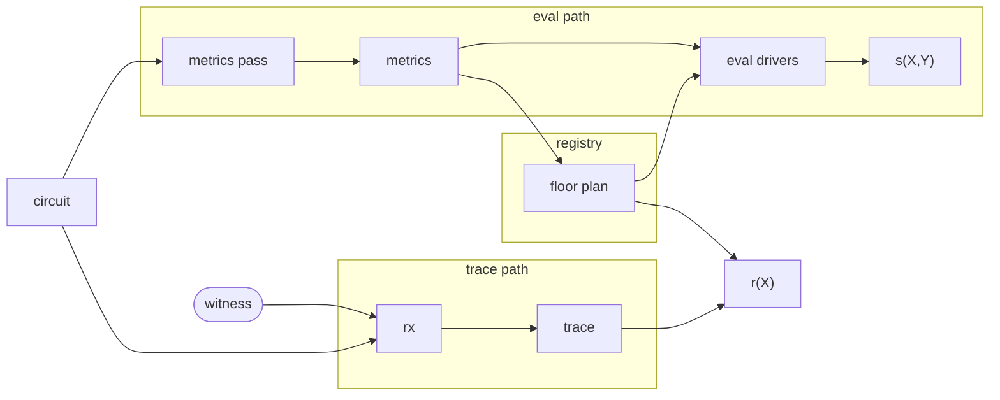

# Routines

[Routines](../guide/routines.md) are self-contained portions of circuit code
that satisfy a simple function-like interface: they take a single [`Input`]
gadget and a [`Driver`] handle, and return a single [`Output`] gadget. They are
permitted to do anything that normal circuit code can do with a
[driver](../guide/drivers.md), such as making gates ([`mul`], [`alloc`]) and
constraining their wires ([`enforce_zero`]).

It is possible to invoke them by manually calling their [`Routine::execute`]
method, but this almost always defeats the purpose of the abstraction. Instead,
they are meant to be invoked through the [`Driver::routine`] method, which hands
control and visibility of its execution to the driver.

```admonish info
Drivers do not learn the [`TypeId`] of a [`Routine`] they are asked to `execute`,
since [`Routine`] does not implement [`Any`] / `'static`. Even if they could
learn this, routines of the same type are allowed to diverge in their actual
behavior because they can be arbitrarily configured, so long as they remain
deterministic.
```

Drivers cannot distinguish routines themselves but merely their **invocations**;
in each `routine` call, they learn the [`TypeId`] of their [`Input`] and
[`Output`] gadgets, and thanks to
[fungibility](../guide/gadgets/index.md#gadget-trait-fungibility) this is very
useful for their structural analysis (via [conversions]) and induces stable
algebraic properties at routine boundaries.

### Algebraic Description

Routines exploit the fact that contiguous sections of code tend to have
algebraically convenient structure in the resulting wiring polynomial $s(X, Y)$:

* `mul` advances an $i$ counter and returns $(X^{2n - 1 - i}, X^{2n + i}, X^{4n - 1 - i})$ wires.
* `enforce_zero` advances a counter $j$ and adds a fresh linear combination of previous wires multiplied by $Y^j$.

Most of the linear constraints created within a routine consist purely of wires
created within that routine, meaning that the **internal** contribution of a
routine can be written as polynomials $g_x, g_{x^{-1}}$ and memoized if the
routine is invoked multiple times. Given a cache hit, we need only scale $g_x$
and $g_{x^{-1}}$ by powers of $Y^j X^i$ (or $Y^j X^{-i}$) to obtain the correct
internal $s(X, Y)$ for an equivalent invocation.

The **interface** contribution to $s(X, Y)$ involves wires created outside the
routine, such as the input gadget wires or the fixed `ONE` wire. This is less
amenable to memoization because these wires can vary between invocations; we
must generally maintain separate polynomials $h_\ell$ for every interface wire.

Taken together, the **contribution** of a routine invocation to $s(X, Y)$ can be
written as

$$
Y^j \Big( X^i g_x + X^{-i} g_{x^{-1}} + \sum_\ell h_\ell \Big)
$$

for some **repositioning** values $i, j$.

## Pipeline



Ragu learns about invocations by executing circuit code in an analysis pass that
collects metrics about each routine invocation. Because circuit synthesis is
deterministic, invocations appear in a canonical **DFS order** during
synthesis. Each invocation's position in that order is its **DFS index**. The
metrics can reliably identify each invocation by this index for the benefit of
future execution of the same circuit code.

All of the metrics for every wiring polynomial added to the registry are fed
into a **floor planner** that is responsible for making scheduling and
relocation decisions in advance of future circuit operations, such as wiring
polynomial evaluation or trace polynomial assembly. The floor planner's goal is
to maximize the optimization opportunities of those operations, usually by
rearranging the wiring polynomials of the circuits in some way. The result
is a floor plan, which is maintained by the registry.

The wiring polynomial evaluators use the floor plan to properly align and
memoize arithmetic to reduce the cost of evaluating the registry polynomial. The
trace polynomial assembly process produces an unassembled trace of execution for
a given witness, and the registry uses the floor plan to translate this to the
actual trace polynomial $r(X)$.

## Segments

Execution traces are divided into **segments**. All wires allocated outside of
routine invocations belong to a single **root segment**.[^root-segment] Each
routine invocation creates a new segment containing only the wires allocated
directly within it; nested calls produce their own segments in turn. The
`CircuitExt::rx` method produces a `Trace` that contains these segments in DFS
order, but their actual arrangement in the trace polynomial depends on the floor
plan's repositioning values.

[^root-segment]: The root segment is not repositioned. It contains the special
    `ONE` wire and is where all stage wires are located.

Each segment has its own [contribution](#algebraic-description) to $s(X, Y)$. A
leaf routine invocation — one with no nested calls — contributes exactly one
segment. When a routine nests further calls, its **total contribution** is the
sum of its own segment's contribution and every descendant segment's. These
segments are not independent: routines send and receive wires through [`Input`]
and [`Output`] gadgets, and those wires are often allocated in different
segments.

Because each wire's location in $s(X, Y)$ is a monomial in $X$ determined by the
gate offset of whichever segment allocated it, a constraint referencing a
foreign wire creates a positional dependency between the two segments. A routine
invocation and all of its descendants thus form a **subtree** of
positionally-dependent segments. If every segment in a subtree sits at a fixed
relative offset from the root, all wire locations shift uniformly — the subtree
is a single relocatable unit that can be memoized. If the floor planner
positions descendants independently, cross-segment wire locations introduce
additional positional degrees of freedom and the subtree must be handled
per-segment.

### Allocation

Allocation allows gates to be reused as a source of wire values. The allocator
state (parity and gate index) are stashed whenever a routine is invoked. This
prevents allocation state from crossing segment boundaries, which would
contaminate their contributions and interfere with repositioning and
memoization.

```admonish info
As an optimization, it is theoretically possible for routine invocations to be
inlined so that they effectively take place within their parent's segment. This
decision could be encoded into the floor plan. However, this would require the
trace computation to be aware of this decision (affecting the pipeline above) or
would require additional metadata to be stored in the `Trace` for adjustment
during assembly. **As a simplification, we assume all routine invocations are
out-of-line.**
```

[`TypeId`]: core::any::TypeId
[`Routine`]: ragu_core::routines::Routine
[`Driver`]: ragu_core::drivers::Driver
[`Driver::routine`]: ragu_core::drivers::Driver::routine
[`Input`]: ragu_core::routines::Routine::Input
[`Output`]: ragu_core::routines::Routine::Output
[`Routine::execute`]: ragu_core::routines::Routine::execute
[`enforce_zero`]: ragu_core::drivers::Driver::enforce_zero
[`mul`]: ragu_core::drivers::Driver::mul
[`alloc`]: ragu_core::drivers::Driver::alloc
[`Any`]: core::any::Any
[conversions]: ../guide/gadgets/conversion.md
