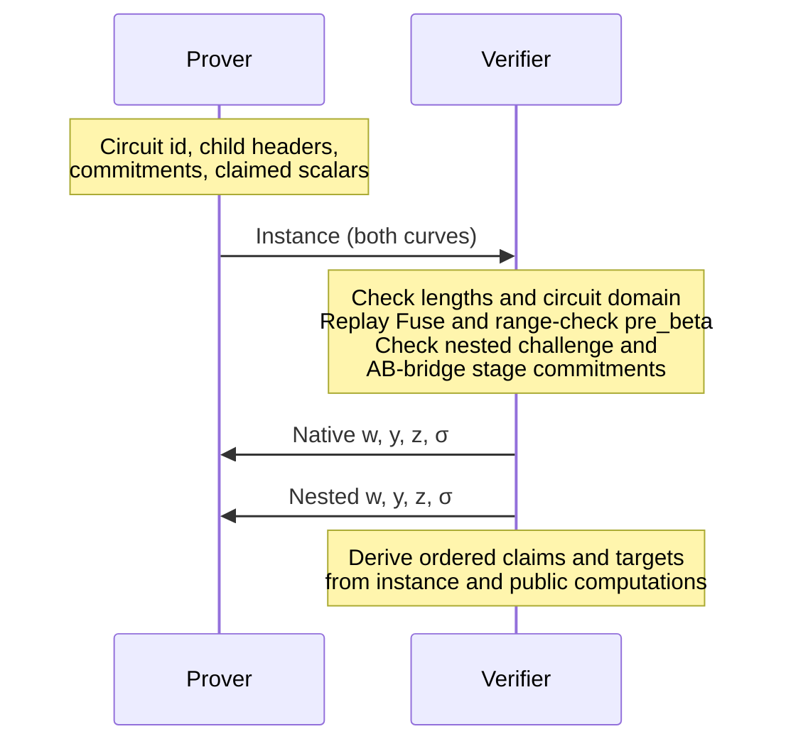
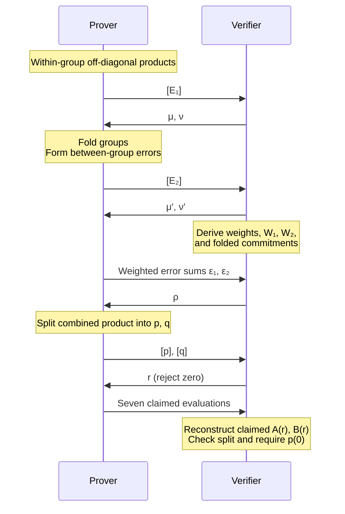
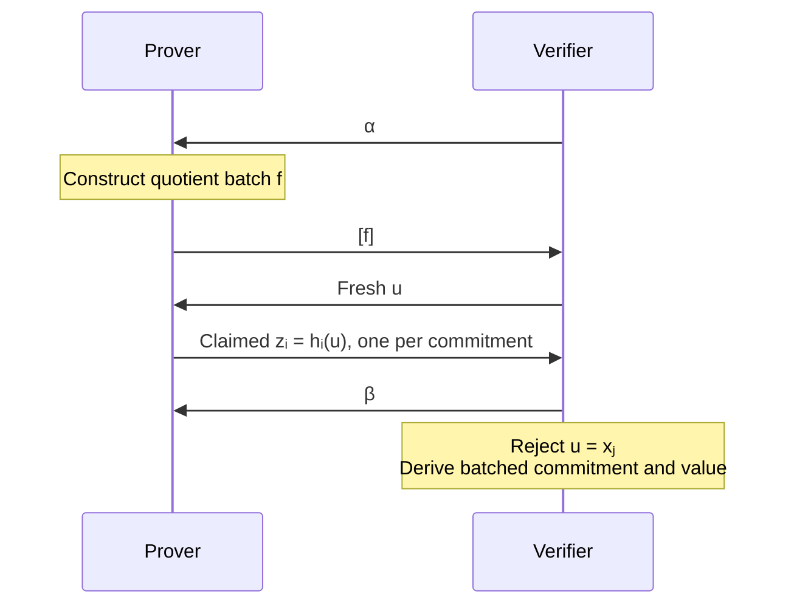
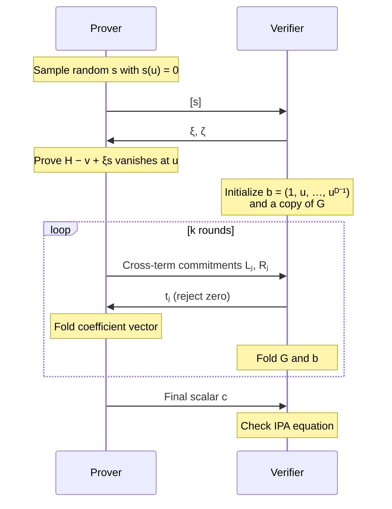

# Compression

Compression replaces witness polynomials with commitments, claimed evaluations,
and one IPA per curve. Below is the interactive form of
`Application::verify_compressed`; Fiat–Shamir supplies the verifier's challenges.

**Shared inputs:** registry, output header, rank $D=2^k$, and generators
$G_0,\ldots,G_{D-1},U$ with no known nontrivial discrete-log relations.
For degree below $D$, write $[h]=\sum_i h_iG_i$ and
$\operatorname{revdot}(a,b)=\sum_i a_i b_{D-1-i}$.

## 1. Instance → revdot claims

**Output:** circuit, bonding, accumulator, and selected-wire relations
$\operatorname{revdot}(a_i,b_i)=k_i$, described by commitments and public terms.

Run phases **2–4 completely on the native curve, then the nested curve**, using
each curve's scalar field.

## 2. Revdot claims → polynomial-opening claims

- **Fold weights:** for claim $i$ in group $g$, slot $s$ (zero-based),
  $\lambda_i=(\mu')^g\mu^s$, $\eta_i=(\nu')^g\nu^s$.
  Set $A=\sum_i\lambda_i a_i$, $B=\sum_i\eta_i b_i$, and
  $K=\sum_i\lambda_i\eta_i k_i+\varepsilon_1+\varepsilon_2$.
- **Error layout:** pack actual off-diagonal terms in group/row order, padding
  to $D$. Inner weights are $(\mu'\nu')^g\mu^s\nu^t$; outer weights are
  $(\mu')^g(\nu')^h$. A term at degree $d$ pairs with its weight at
  degree $D-1-d$ in $W_\ell$; zero-fill the rest. Both lists must fit.
- **Derived commitments:** V combines committed $a$, raw $b$, and circuit $a$
  parts under $\lambda,\eta,\eta$ to obtain $[A_c],[B_c],[T]$.
- **P claims:** $A_c(r),T(rz),B_c(r),E_1(r),E_2(r),p(r^{-1}),q(r)$.
  V adds public registry, wiring, mask, and expected-value terms:

$$
\begin{aligned}
A(r)&=A_c(r)+A_{\rm pub}(r),\\
B(r)&=B_c(r)+T(rz)+B_{\rm pub}(r).
\end{aligned}
$$

**V checks the split:**

$$
A(r)B(r)+\rho E_1(r)W_1(r)+\rho^2E_2(r)W_2(r)
=r^{D-1}p(r^{-1})+r^Dq(r).
$$

**Output:** the seven opening obligations plus
$p(0)=K+\rho\varepsilon_1+\rho^2\varepsilon_2$, whose required value V derives.
V also adds the registry restriction at $w$ and Fuse's $P,A,B$ at replayed
$u_{\rm Fuse}$, with values from the registry or instance.
These openings still require verification.

## 3. Opening claims → one batched opening

**Input:** $m>0$ claims $h_{i_j}(x_j)=y_j$ over $n>0$ commitment entries.
Polynomial order is $A_c,T,B_c,E_1,E_2,p,q$, registry, then Fuse's $P,A,B$;
the second query of $p$ reuses its index.

**P constructs** $f(X)=\sum_{j=0}^{m-1}\alpha^{m-1-j}
\frac{h_{i_j}(X)-y_j}{X-x_j}$; **V derives**

$$
\begin{aligned}
[H]&=\beta^n[f]+\sum_{i=0}^{n-1}\beta^{n-1-i}[h_i],\\
v&=\beta^n\sum_{j=0}^{m-1}\alpha^{m-1-j}\frac{z_{i_j}-y_j}{u-x_j}
  +\sum_{i=0}^{n-1}\beta^{n-1-i}z_i.
\end{aligned}
$$

**Output:** one opening claim $([H],u,v)$ for the IPA to verify.

## 4. Batched opening → IPA verification

V folds $G\leftarrow G_L+t_jG_R$, $b\leftarrow b_L+t_jb_R$, obtaining
$G_*,b_*$. Using the original $G_0$, it checks

$$
[H]-vG_0+\xi[s]+\sum_{j=0}^{k-1}(t_j^{-1}L_j+t_jR_j)
=c(G_*+\zeta b_*U).
$$

**Output:** accept only if both curves pass.
