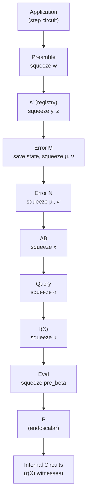

# Protocol Mechanics

The preceding chapters describe the ingredients of Ragu's recursive proof
system in isolation: a [NARK](../core/nark.md) that reduces circuit
satisfiability to revdot claims, an
[accumulation scheme](../core/accumulation/index.md) that defers expensive
checks across recursion steps, and a
[staging mechanism](../extensions/staging.md) that bridges computation across
the curve cycle. This chapter describes how these pieces compose into a single
recursive protocol where each new proof absorbs two child proofs.

## Proof Structure

A `Proof` in Ragu contains twelve components, grouped by purpose:

**Application layer**: binds the proof to a specific step circuit and its
data:

| Component | Contents |
|-----------|----------|
| `application` | Circuit identity, left/right headers, witness polynomial $r(X)$ and its commitment |

**Accumulation layer**: carries the accumulated claims from child proofs
through folding:

| Component | Contents |
|-----------|----------|
| `preamble` | Encodes child proof commitments for the current step |
| `s_prime` | Registry restriction polynomials $s'(W, x_0)$, $s'(W, x_1)$ |
| `error_m` | Layer-1 error terms from folding $M$ claims per group, plus registry polynomial $m(W, y)$ |
| `error_n` | Layer-2 error terms from folding $N$ groups into a single claim |
| `ab` | Final folded polynomials $a(X)$, $b(X)$ and scalar $c$ |
| `query` | Claimed evaluations of committed polynomials at challenge points |
| `f` | Multi-quotient polynomial witnessing correct evaluations |
| `eval` | Evaluation polynomial for the PCS aggregation |
| `p` | Final commitment polynomial $P(X)$, evaluation $v$, and endoscalar data |

**Derived values**: computed from the proof but not independent commitments:

| Component | Contents |
|-----------|----------|
| `challenges` | The eleven Fiat-Shamir challenges: $w, y, z, \mu, \nu, \mu', \nu', x, \alpha, u, \text{pre\_beta}$ |
| `circuits` | Witness polynomials $r(X)$ and commitments for each of the five internal verification circuits |

Most accumulation-layer components carry both a *native* $r(X)$ commitment (on
the host curve, verifiable directly) and a *nested* $r(X)$ commitment (on the
other curve in the cycle, verified at the next recursion step via
[staging](../extensions/staging.md)).

## The Fuse Pipeline

Producing a new proof from two child proofs (called *fusing*) proceeds through
eleven sequential computations. Each computation extends a Fiat-Shamir
transcript, and the challenges squeezed from the transcript bind subsequent
computations to everything that came before.

<!-- TODO: replace this Mermaid diagram with a static image -->

### Step-by-step

1. **Application**: Execute the user-defined step circuit on the two child
   proofs' data and the step witness. This produces the application $r(X)$
   polynomial and commitment.

2. **Preamble**: Encode the child proofs' nested commitments and headers into
   the current proof's native field. The resulting commitment is absorbed into
   the transcript, and the challenge $w$ is squeezed.

3. **$s'$ (registry restrictions)**: Evaluate the
   [registry polynomial](../extensions/registry.md) at $(w, x_0)$ and
   $(w, x_1)$, where $x_0, x_1$ are the child proofs' respective $x$
   challenges. This restricts the wiring consistency check to the circuits
   actually used by the child proofs. The commitment is absorbed, and
   challenges $y$ and $z$ are squeezed.

4. **Error $M$ (layer-1 folding)**: Compute the error terms for the first
   layer of revdot claim reduction. Each group of $M = 7$ claims produces
   $M^2 - M = 42$ cross-terms. The transcript state is saved at this point
   (for later use by the hash circuits), and challenges $\mu$ and $\nu$ are
   squeezed.

5. **Error $N$ (layer-2 folding)**: Reduce the $N = 19$ groups from layer 1
   into a single revdot claim $(a, b, c)$, producing $N^2 - N = 342$
   cross-terms. Challenges $\mu'$ and $\nu'$ are squeezed.

6. **$AB$ (final claim)**: Commit to the folded $a(X)$ and $b(X)$ polynomials
   and compute $c = \text{revdot}(\vec a, \vec b)$. Challenge $x$ is squeezed.

7. **Query**: Evaluate each committed polynomial at the relevant challenge
   points ($x$, $xz$, $w$, and the internal circuit indices $\omega_j$). The
   registry polynomial $m(W, x, y)$ is also committed here. Challenge $\alpha$
   is squeezed.

8. **$f(X)$ (multi-quotient)**: Construct the multi-quotient polynomial that
   witnesses the correctness of all claimed evaluations from the query phase.
   The polynomial is built by interleaving factor iterators across all
   evaluation claims, combined with powers of $\alpha$. Challenge $u$ is
   squeezed.

9. **Eval**: Compute the evaluation polynomial for PCS aggregation. Challenge
   $\text{pre\_beta}$ is squeezed (the effective $\beta$ is derived later via
   endoscalar extraction in the nested curve).

10. **$P$ (commitment polynomial)**: Assemble the final commitment polynomial
    $P(X)$ and compute $v = P(u)$. Endoscalar extraction produces the nested
    curve points that encode the cross-curve commitment consistency.

11. **Internal circuits**: Compute the $r(X)$ witness polynomials and
    commitments for each of the five internal verification circuits (see
    [below](#internal-circuits)).

## Fiat-Shamir Transcript

The fuse pipeline derives all challenges from a single Poseidon sponge. The
prover absorbs each new commitment into the sponge before squeezing the next
challenge, ensuring the entire proof is bound to a single consistent
transcript.

For recursive verification, the verifier must *re-derive* these challenges
inside a circuit. Poseidon hashing inside a circuit is expensive, so Ragu
splits the transcript verification across two internal circuits:

- **hashes_1** derives $w$, $y$, and $z$ by absorbing the preamble, $s'$, and
  error $M$ commitments. It then *saves the sponge state* for handoff.

- **hashes_2** resumes from the saved sponge state and derives the remaining
  challenges: $\mu, \nu, \mu', \nu', x, \alpha, u, \text{pre\_beta}$.

The saved transcript state bridges the two circuits. During fuse, the state is
captured after the error $M$ commitment is absorbed, serialized into field
elements, and passed as witness data to the error $N$ computation.

## Two-Layer Revdot Reduction

Each child proof carries accumulated [revdot](../core/nark.md) claims one
per committed polynomial. Fusing two children means the new proof must absorb all of these
claims into a single $(a, b, c)$ triple. The folding has capacity for up to
$N \cdot M$ claims per child (where $N = 19$ and $M = 7$, giving a capacity
of 133 claims); unused slots are padded with zeros. A direct reduction of all
claims would require $O(n^2)$ cross-terms at once.

Instead, Ragu uses a two-layer reduction:

**Layer 1 (partial_collapse)**: Group the claims into $N = 19$ groups of $M =
7$. Within each group, fold $M$ claims into one using random challenges
$(\mu, \nu)$. This produces $N$ intermediate claims and $N \cdot (M^2 - M) =
19 \cdot 42 = 798$ error terms.

**Layer 2 (full_collapse)**: Fold the $N = 19$ intermediate claims into a
single claim using challenges $(\mu', \nu')$. This produces $N^2 - N = 342$
error terms.

The total cost is $N(M^2 - M) + (N^2 - N) = 1140$ error terms, compared to
$(NM)^2 - NM = 17{,}556$ for a single-layer approach.

### Base case

When both child proofs are trivial (the base case), the prover may witness any
$c$ value without constraint. The `full_collapse` circuit detects this
condition via `is_base_case` (derived from the child proof headers) and relaxes
the final $c$-equality constraint: the folding computation still runs, but its
result is not enforced against the witnessed $c$. This allows seeding the
recursion with initial proofs that do not yet carry meaningful revdot claims.

## Internal Circuits

The recursive verifier is split into five internal circuits that collectively
check the previous fuse step was performed correctly:

| Circuit | Role |
|---------|------|
| `hashes_1` | Re-derives $w, y, z$ from the transcript (first half) |
| `hashes_2` | Re-derives $\mu, \nu, \mu', \nu', x, \alpha, u, \text{pre\_beta}$ from the saved transcript state (second half) |
| `partial_collapse` | Verifies layer-1 folding with $(\mu, \nu)$ |
| `full_collapse` | Verifies layer-2 folding with $(\mu', \nu')$, handles base case |
| `compute_v` | Derives effective $\beta$ from $\text{pre\_beta}$ via endoscalar extraction, checks $v = f(u) + \beta \cdot \text{eval}$ |

### Unified output

Four of the five internal circuits (`hashes_2`, `partial_collapse`,
`full_collapse`, `compute_v`) share a common set of 29 public-input wires
defined by the `Output` structure. The fifth circuit (`hashes_1`) extends
this structure with the left and right child proof output headers, since it
additionally binds the proof to specific header data. The shared wires
include:

- Nested curve commitments from each proof component (preamble, $s'$, error
  $M$, error $N$, $AB$, query, $f$, eval)
- Fiat-Shamir challenges ($w, y, z, \mu, \nu, \mu', \nu', x, \alpha, u,
  \text{pre\_beta}$)
- Final claim values ($c$ and $v$)

Sharing the output structure avoids redundant $k(Y)$ evaluations across
circuits and simplifies the [registry](../extensions/registry.md) wiring.
Each circuit is assigned an `InternalCircuitIndex` (13 indices total: 5
stages, 3 final-staged masks, and 5 circuits) that determines its position in
the registry domain.

### Stage dependencies

Not every circuit uses every stage's witness data. The stage dependency chains
are:

- `hashes_1`: preamble → error $N$ → *circuit*
- `hashes_2`: preamble → error $N$ → *circuit*
- `partial_collapse`: preamble → error $N$ → error $M$ → *circuit*
- `full_collapse`: preamble → error $N$ → *circuit*
- `compute_v`: preamble → query → eval → *circuit*

Each chain determines which stage masks the circuit uses and which "final
staged" mask applies (see [Staging](../extensions/staging.md)).

## Cross-Curve Structure

Ragu operates over a two-cycle of elliptic curves (concretely, Pallas and
Vesta from the [Pasta](https://electriccoin.co/blog/the-pasta-curves-for-halo-2-and-beyond/)
family). The *host curve* is the curve whose scalar field matches the circuit
field; the *nested curve* is the other curve in the cycle.

Each proof component that carries a polynomial commitment produces two
commitments:

1. A **native commitment** on the host curve, computed as
   $\text{commit}(r(X)) = \sum r_i \cdot G_i + b \cdot H$ where $G_i, H$ are
   host curve generators. This can be verified directly in the circuit field.

2. A **nested commitment** on the nested curve, computed analogously with
   nested curve generators. This commitment *cannot* be verified natively
   (the nested curve's arithmetic lives in the other field), so its
   verification is deferred to the next recursion step via staging.

This deferred verification is the mechanism that makes recursion efficient:
each step only verifies the native-curve claims directly, while the
nested-curve claims are accumulated and checked one step later. The
[staging](../extensions/staging.md) mechanism ensures these deferred checks
are not lost.
