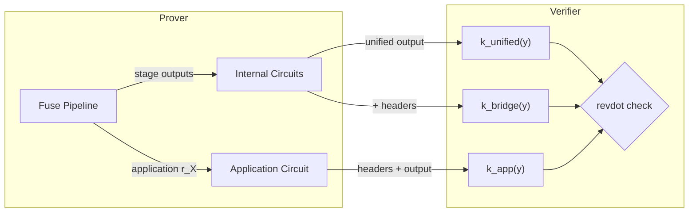

# Public Inputs vs Stage Outputs

Three distinct concepts describe the data that flows through Ragu's recursive
proof system. They are often conflated, but serve different roles and are
visible to different participants.

## Public Inputs: $k(Y)$

Recall from the [NARK](../core/nark.md) chapter that a circuit's public inputs
are encoded as a polynomial $k(Y)$. The verifier evaluates $k(y)$ at a random
point $y$ and checks that the revdot claim holds:

$$\text{revdot}(\vec a, \vec b) = k(y)$$

In Ragu's recursive setting, $k(Y)$ is not a single polynomial. The protocol
instantiates three distinct $k(Y)$ evaluations, each encoding a different
aspect of the proof:

### `unified_ky`

This is the $k(y)$ value for the internal verification circuits. It encodes
the [unified output](index.md#unified-output) — the 29 shared public-input
wires — followed by a zero element (the `WithSuffix` padding):

$$k_{\text{unified}}(Y) = \text{Horner}(\texttt{unified\_output} \| 0 \| 1, \; Y)$$

The trailing constant $1$ comes from the Horner evaluation wrapper (`Ky`),
which appends it after all wires have been absorbed. The zero element before it
is the `WithSuffix` padding that distinguishes internal circuits from
application circuits (see [substitution attack prevention](#substitution-attack-prevention)).

Four of the five internal circuits (`hashes_2`, `partial_collapse`,
`full_collapse`, `compute_v`) use this $k_{\text{unified}}(y)$ value directly.
The stages and final-staged masks receive zero for their $k(y)$ values (their
constraints are enforced through the stage masking mechanism instead). The
fifth circuit (`hashes_1`) uses $k_{\text{bridge}}(y)$ rather than
$k_{\text{unified}}(y)$, since it additionally binds the child proof headers.

### `unified_bridge_ky`

This extends `unified_ky` with the child proof headers, binding the proof to
the specific data it claims to carry:

$$k_{\text{bridge}}(Y) = \text{Horner}(\texttt{unified\_output} \| \texttt{left\_header} \| \texttt{right\_header} \| 0 \| 1, \; Y)$$

The bridge $k(y)$ is used in the verification check that connects the internal
circuit claims to the application-level data. It ensures that a proof cannot
claim to carry data for one pair of headers while actually proving a different
pair.

### `application_ky`

This is the $k(y)$ for the user-defined step circuit. It encodes the child
headers and the output header, without the unified output or the zero suffix:

$$k_{\text{app}}(Y) = \text{Horner}(\texttt{left\_header} \| \texttt{right\_header} \| \texttt{output\_header} \| 1, \; Y)$$

The absence of the zero suffix is what distinguishes application circuits from
internal circuits (see below).

### Horner evaluation

All three $k(Y)$ values are computed via streaming Horner evaluation. Given
wires $w_0, w_1, \ldots, w_{n-1}$ and a trailing constant $1$:

$$k(y) = (\cdots((w_0 \cdot y + w_1) \cdot y + w_2) \cdots + w_{n-1}) \cdot y + 1$$

The `Ky` buffer accumulates wire values one at a time, multiplying by $y$
between each absorption, and appends the trailing $1$ on `finish()`. This
streaming design allows partial computation to be shared: `unified_ky` and
`unified_bridge_ky` diverge only after the unified output wires are absorbed,
so the computation up to that point is shared and then cloned.

## Stage Outputs

Stage outputs are the data that each fuse pipeline computation produces and
passes to subsequent computations. They are
**prover-internal** — the verifier never sees them directly.

Each fuse stage typically produces:

- A **polynomial** (structured or unstructured) and its **blinding factor**
- A **native commitment** on the host curve
- A **nested $r(X)$ polynomial** and **nested commitment** on the nested curve
- **Witness data** consumed by later stages or by internal circuits

For example, the preamble stage produces its native $r(X)$, native commitment,
nested $r(X)$, nested commitment, and a `Witness` struct containing processed
child proof data. The error $M$ stage additionally produces a `claims` struct
consumed by error $N$.

A notable stage output is the **saved transcript state**: after the error $M$
commitment is absorbed into the Poseidon sponge, the sponge state is
serialized into field elements and passed forward. This bridges the `hashes_1`
and `hashes_2` internal circuits, which split the Fiat-Shamir transcript
verification.

## Staging Circuit Outputs

Staging circuit outputs are what the recursive verifier actually checks. They
are the public inputs of the internal circuits, encoded through the $k(Y)$
mechanism.

Four of the five internal circuits (`hashes_2`, `partial_collapse`,
`full_collapse`, `compute_v`) output the 29-wire `Output` structure containing
nested commitments, Fiat-Shamir challenges, and the final values $c$ and $v$.
The fifth circuit (`hashes_1`) extends this structure with the left and right
child proof output headers, producing a wider output that enables
$k_{\text{bridge}}(y)$ verification. The `OutputBuilder` constructs the shared
portion within each circuit, ensuring that each circuit constrains its portion
of the unified output while the remaining wires are passed through from the
stage inputs.

The verifier checks these outputs by evaluating each $k(y)$ variant and
comparing it against the corresponding revdot claim:

1. The raw $c$ value from the $AB$ component is checked directly (this is the
   final folded revdot scalar, not a $k(y)$ evaluation)
2. $k_{\text{app}}(y)$ is compared against the application circuit's claim
3. $k_{\text{bridge}}(y)$ is compared against the bridge claim (binding
   headers to the proof)
4. $k_{\text{unified}}(y)$ is compared against the claims for four internal
   circuits (`hashes_2`, `partial_collapse`, `full_collapse`, `compute_v`)
5. Stage and final-staged mask claims receive zero (their constraints are
   enforced through [staging](../extensions/staging.md) masks)

## How They Connect

<!-- TODO: replace this Mermaid diagram with a static image -->

The flow is:

1. The fuse pipeline produces **stage outputs** (prover-internal polynomials,
   commitments, and witness data).

2. The internal circuits consume stage outputs as witness data and produce
   **staging circuit outputs** (the 29-wire unified output, constrained as
   public inputs via $k(Y)$).

3. The verifier evaluates the three $k(y)$ variants and checks each against
   the corresponding revdot claim. If all claims hold, the recursive step is
   valid.

## Substitution Attack Prevention

Internal circuits and application circuits occupy different positions in the
registry, but an attacker might try to substitute one for the other — for
instance, providing an internal circuit proof where an application circuit
proof is expected.

Ragu prevents this by ensuring the $k(Y)$ polynomials for internal and
application circuits are structurally distinct. Internal circuit outputs are
wrapped in `WithSuffix`, which appends a zero element before the trailing
$1$. This forces the linear term of $k(Y)$ to be zero for internal circuits.

Application circuits encode headers and output data directly, without the zero
suffix. Because the final element of each padded header is the header suffix,
the linear term of $k(Y)$ is deterministically non-zero for application
circuits.

This structural difference means no valid application $k(Y)$ can equal a valid
internal $k(Y)$, preventing cross-type substitution.
